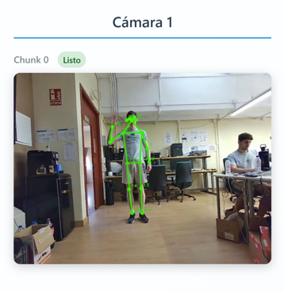

# Multi-Camera Frontend Client for Gait Analysis

This is the frontend component of a markerless gait analysis system for knee osteoarthritis, an open source project built at the University of Malaga with Costa del Sol Hospital during a research laboratory placement. It discovers the Orbbec cameras, records them, cuts the recording into chunks of 5 seconds and sends each chunk to the analysis server, which is where 2D pose estimation and 3D reconstruction happen.

<p align="center">
  
  
  
</p>
<p align="center">
  
</p>
<p align="center"><em>The three views recorded by this client, with the 2D detections and the 3D skeleton that the analysis server computes from them.</em></p>

The person in these images is the main author, recorded during development. Sessions with real patients are recorded and kept by the hospital under the GDPR and the Spanish LOPDGDD, and no patient data is committed to this repository.

There is no hardware trigger between the cameras, so the three views of an instant are three reads of the same loop. Everything downstream treats them as simultaneous, because the relative pose of the cameras is estimated from keypoints that are assumed to belong to one instant.

I designed the structure of this client. The analysis server is in the `markerless-gait-analysis-backend` repository.

## Recording

Recording happens in one thread with one loop. Each pass reads a frame from every initialized camera with `wait_for_frames(1000)`, converts the Orbbec RGB buffer to BGR and writes it to the `cv2.VideoWriter` of that camera. The loop does no other work while recording, and no camera can block it for more than one second.

The chunks are written as `camera{n}/{sequence}.mp4`, with a counter for each camera, and every finished chunk is uploaded in its own thread while the loop opens the next one. That sequence number is the contract with the analysis server, which only starts fusing the detectors when all the cameras have delivered the same final index.

The size and the frame rate of each writer are taken from the camera profile that was actually granted, and not from the 640x480 at 30 fps that the configuration asks for. The requested profile is not always available, and a writer opened at the wrong rate produces a file whose duration does not correspond to what happened in the room.

## Session flow

The operator opens the page, writes the patient identifier and the session number, and starts the recording. The client notifies the server that the session begins, records until the operator finishes or cancels, and then reports the result to the server as well.

Stopping needs some care, because the last chunk is the one that can be lost. The recording loop is given up to 15 seconds to finish, and after that up to 30 additional frames are read from each camera to close the current chunk, so that the recording does not end in the middle of a stride. Cancelling takes the opposite path: the writers are released, the local files are deleted and the server is told to discard the session.

A camera that stops sending video does not fail in an obvious way, it just stalls the session. The server detects this on its side, checking when the first chunk 2 arrives that every camera also produced a chunk 0, and answers the upload with `CAMERA_FAILURE_DETECTED`. The client then cancels the local session, deletes the temporary files and disables the buttons, so that the operator restarts the capture instead of continuing a session that is missing one of the three views. The page polls the recording status every 2 seconds for this reason.

The Orbbec SDK is only used inside `backend/camera_manager/camera_manager.py`. The rest of the code works with numpy arrays, so supporting cameras of another brand means writing a second manager and not rewriting the client.

## Running it

The SDK is a compiled submodule, so `pip install -r requirements.txt` on its own is not enough. On Windows, with CMake 3.15+ and the Visual Studio Build Tools installed:

```bash
instalar.bat
```

The script clones `pyorbbecsdk`, builds it, copies the `.pyd` and the DLLs next to it, and checks that the import works and that the cameras answer. `docs/INSTALACION_SDK.md` explains the same steps manually.

Set `SystemConfig.SERVER.base_url` in `backend/config/settings.py` to the address of the analysis server, which sits on the same local network, and start the client:

```bash
python main.py
```

The operator page is served at `http://127.0.0.1:5000`. It shows the number of connected cameras and the fields for patient and session, with buttons to start, cancel and finish. There is no video preview, so a camera that stops answering appears through the status polling instead of being seen.

## Local API

These are the endpoints used by the page. In the other direction, the client calls four endpoints of the analysis server, all of them configured in `settings.py`: `session/start` when a session opens, `chunks/receive` for every chunk, and `session/end` or `session/cancel` depending on how the session finishes.

| Method | Endpoint | Effect |
| --- | --- | --- |
| `GET` | `/api/cameras/discover` | Serial numbers of the connected devices. |
| `POST` | `/api/cameras/initialize` | Open the pipelines, all discovered devices if none are given. |
| `GET` | `/api/cameras/status` | Read one frame per camera to see which ones answer. |
| `POST` | `/api/recording/start` | Open the session, announce it to the server and start the loop. |
| `GET` | `/api/recording/status` | Recording state and the camera failure flag that the page polls. |
| `POST` | `/api/recording/stop` | Close and upload the final chunks, end the session on the server. |
| `POST` | `/api/recording/cancel` | Stop, delete the local files, tell the server to discard the session. |
| `GET` | `/api/system/health` | Initialized cameras, recording state, server address in use. |
| `POST` | `/api/system/cleanup` | Release the camera pipelines. |

`docs/main_classes.md` describes the classes behind these endpoints.

## Limitations

- There is no hardware trigger and no alignment by timestamp between views. The offset between cameras was verified visually and is not characterized.
- The cameras are initialized one by one with a pause of 0.5 s between them, which was needed to avoid conflicts of resources and makes the startup slower than it seems.
- A failed upload is logged and the chunk stays on disk. There is no retry queue.
- The state of the session lives in module level singletons, one session at a time, and restarting the process loses it.
- Windows in practice: the installer is a `.bat` file and the SDK binaries come from `lib/win_x64`.
- `backend/tests/grabacion_simple.py` is a prototype for checking the cameras by hand, not a test suite.

## License

Apache 2.0, see `LICENSE.md`. The Orbbec SDK keeps its own terms.
